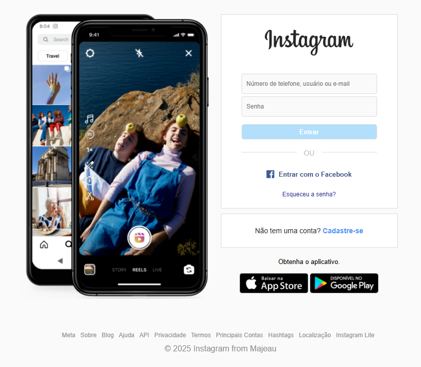

# Instagram Login Page Clone (HTML + CSS)

This is a simple project developed for training purposes. It replicates the Instagram login page using only **HTML** and **CSS**, with no functionality — just layout.

## Purpose

- Practice front-end development skills  
- Learn layout techniques using real interfaces  
- Improve HTML and CSS proficiency

## Features

- Static layout replicating Instagram’s login page  
- Responsive design basics  
- Clean code structure with semantic HTML and organized CSS

## Preview

It does not include any real login functionality and is intended for educational purposes only.

